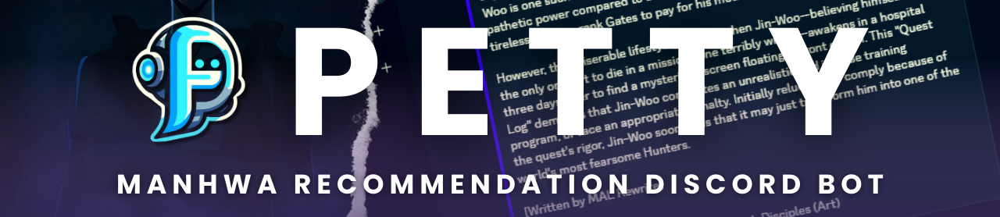

<h1 align="center">Petty | Recommendation Discord Bot</h1>
<h3 align="center">✅ This bot uses discord.js v14</h3>

## 📌 Description

<p align="center">
    
</p>

- Petty is a Discord Bot for Manhwa Recommendation.
- There are more than 2800 manhwa datasets being used.
- Petty has a beautiful terminal logger.

## 🛠 Built With


## 📂 Dataset

The dataset used in this project comes from the [Kaggle](https://www.kaggle.com/datasets/crxxom/manhwa-dataset) website and contains more than 2800 manhwa data obtained through scraping.

- The dataset was last updated at the beginning of 2023.
- Consists of title, chapters, status, genres, synopsis, authors, and many more.

## 💻 Getting Started

### ✅ Setup Your `.env` File

- Edit your [.env](https://github.com/farhanmaul987/Petty/blob/main/.env.example) file.
- Replace the `TOKEN` with your BOT's token.
- Rename `.env.example` to `.env`

### ✅ Configuration `config.json` File

- Edit your [config.json](https://github.com/farhanmaul987/Petty/blob/main/config.json) file.
- Replace the `mainServer` with your Discord Server ID.
- Replace the `devs` with your Discord's ID.

## 🚀 Installation

### :one: Clone this Project

```
git clone https://github.com/farhanmaul987/Petty
cd Petty
```

### :two: Install Dependencies

```
npm install
```

### :three: Run Project

```
npm run start
```

## 🤝 Contribution

- Give this repository a ⭐ if you like it!
- If you have problems, you can open an [issue](https://github.com/farhanmaul987/Petty/issues).
